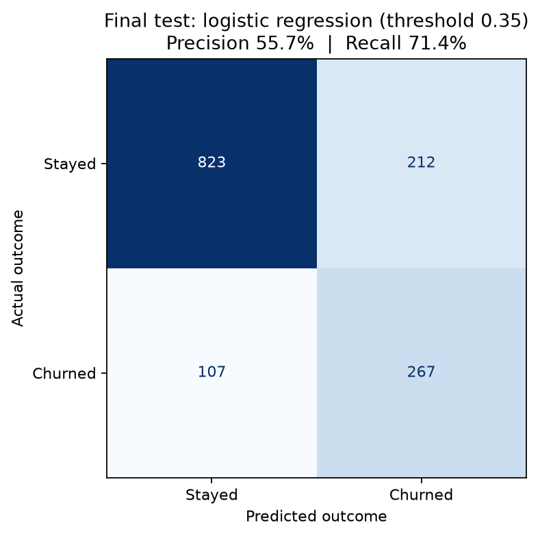

# Customer churn prediction

Can customer account details help identify people likely to cancel their service? I explored IBM's Telco Customer Churn dataset and compared a simple baseline, logistic regression, and XGBoost.

## What I did

The dataset has 7,043 customers. I filled 11 blank `TotalCharges` values for customers with zero months of tenure, encoded categorical columns, and split the data into training, validation, and test sets. I chose the model and decision threshold using validation data, then checked the result on the test set.

## Result

Logistic regression with a 0.35 churn threshold found **267 of 374 churners** in the test set (**71.4% recall**). It flagged 212 customers who stayed and missed 107 who churned. Of the 479 customers it flagged, **55.7% churned**. The baseline predicted that everyone would stay, so it found no churners.

These results show which customers the model identifies as higher risk. The data does not tell us whether contacting them would prevent churn.

## Run the notebook

1. Download [IBM's Telco Customer Churn CSV](https://github.com/IBM/watsonx-ai-samples/blob/master/cpd4.5/data/customer_churn/WA_FnUseC_TelcoCustomerChurn.csv) and put `WA_FnUseC_TelcoCustomerChurn.csv` in this folder.
2. Install the packages with `python -m pip install -r requirements.txt`.
3. Open `customer_churn_project_notebook.ipynb` in VS Code or Jupyter and run all cells.

